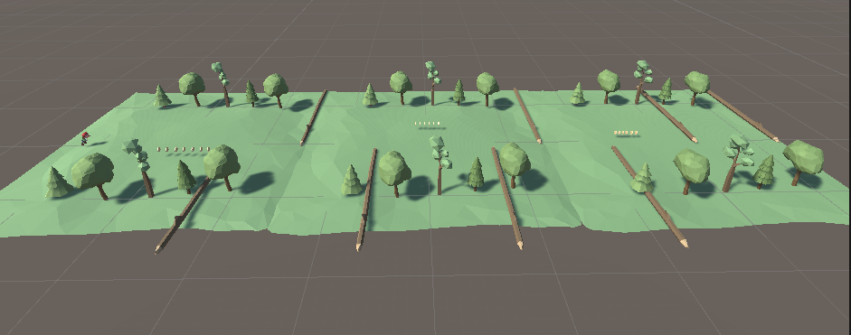
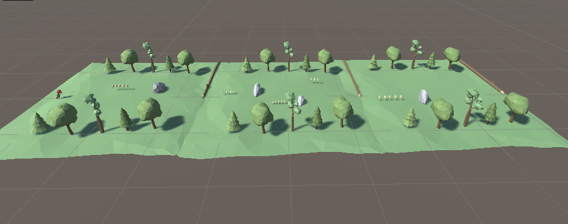
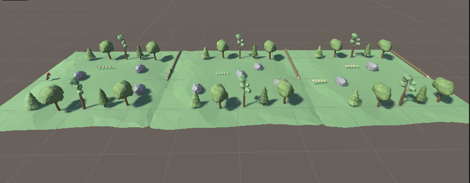

<h1 align="center"> Game Development (Unity 3D) CA-2 </h1>  

### Gameplay

 

  <h3>Level 1</h3>
  

 

 

  <h3>Level 2</h3>
  

 

 

  <h3>Level 3</h3>
  

 

## About The Game
The aim of the game is to collect gold in general. As you collect gold, the number of gold in the upper left increases. The game consists of three levels. When we reach the end of the map, we pass to the new level. The game repeats like this. After the last level, the first level starts again. We have obstacles in the game. When you touch these obstacles, you fail and the level starts again.  
This game is developed using Unity 3D, and the scripting for gameplay elements such as coin collection, object rotation, level upgrades, obstacles, and player movement is implemented in the C# language.  
This game was created under the guidance of Gunseer Kaur.
